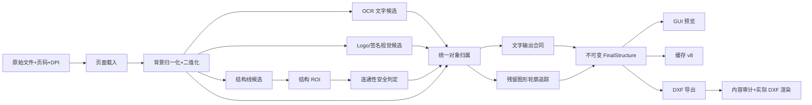

# 完整数据流

```mermaid
flowchart LR
  A["原始文件+页码+DPI"] --> B["页面载入"]
  B --> C["背景归一化+二值化"]
  C --> D["OCR 文字候选"]
  C --> E["Logo/签名视觉候选"]
  C --> F["结构线候选"]
  F --> G["结构 ROI"]
  G --> H["连通性安全判定"]
  D --> I["统一对象归属"]
  E --> I
  H --> I
  C --> I
  I --> J["文字输出合同"]
  I --> K["残留图形轮廓追踪"]
  J --> L["不可变 FinalStructure"]
  K --> L
  L --> M["GUI 预览"]
  L --> N["缓存 v8"]
  L --> O["DXF 导出"]
  O --> P["内容审计+实际 DXF 渲染"]
```

每一步的调试产物携带输入哈希、页码、DPI、配置、算法版本、
`structure_id`、阶段名、时间和上游标识。
