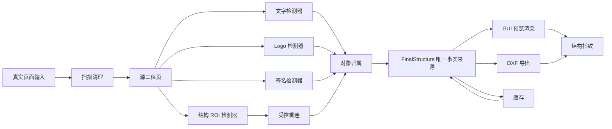

# 图像转 CAD 系统级重构设计

状态：已批准的实现基线
适用范围：`cad_photo_to_dxf/app`、`cad_photo_to_dxf/tests/fixtures`、持续集成与 DXF 导出链路
核心目标：结构数据只有一个事实来源；任何自动连通操作不能触碰正文；对象类别互斥但连通性判断不改变类别。

## 1. 不可破坏的系统约束

1. 禁止对整页或未声明用途的图像区域执行闭运算、膨胀式桥接或其他自动重连。
2. 自动重连只能在结构检测器提供的受控 ROI 中执行。第一阶段只允许两种 ROI：页面边框、封闭表格/标题栏规则网格。
3. 正文、文字候选、Logo、签名及未分类残留区域永不进入自动重连 ROI。
4. GUI 预览、缓存、单页 DXF 和多页 DXF 都只消费同一个不可变 `FinalStructure`。
5. 文字、Logo、签名分别由独立检测器产生，不得相互改写类别，不得依据 OCR 内容、特定字段词、页面固定坐标或页面百分比猜测类别。
6. 内容归属只解决“哪些源像素由哪个已分类对象拥有”；连通性安全判定只回答“这次连接是否仍在结构 ROI 内并且没有跨越受保护对象”，不得改变对象类型。
7. 所有行为变化必须运行完整单元测试和真实文档回归；CI 中真实回归集不能为空。

## 2. 目标模块边界

| 模块 | 唯一职责 | 输入 | 输出 | 明确禁止 |
| --- | --- | --- | --- | --- |
| `scan_cleanup` | 灰度归一化、二值化与扫描伪影抑制 | 原始页面 | `PreparedScanPage` | 全页闭运算、对象分类 |
| `structural_roi` | 从源像素提取边框和规则网格 ROI | 二值页面 | `StructuralRoiSet` | OCR 词义、签名/Logo 分类 |
| `controlled_reconnect` | 在单个已验证结构 ROI 内连接断裂规则 | 二值页面、一个 ROI、保护掩膜 | 局部修复掩膜与审计记录 | 整页处理、ROI 外写入、修改类别 |
| `connectivity_safety` | 判断候选桥接的连通域影响 | 原始/候选局部掩膜、保护掩膜 | 允许/拒绝及原因 | 产生或修改对象类型 |
| `text_detector` | 产生文字候选及字形足迹 | 灰度页面、规则掩膜 | `TextObject` | 推断 Logo/签名 |
| `logo_detector` | 按闭合轮廓、孔洞、紧凑度和重复图形等结构特征识别 Logo | 源像素、规则掩膜 | `LogoObject` | 读取 OCR 字符串、页面位置规则 |
| `signature_detector` | 按笔画连通、方向变化、规则穿越和局部密度识别签名 | 源像素、规则掩膜 | `SignatureObject` | 匹配“签名/审核”等字段词、覆盖文字/Logo |
| `object_ownership` | 将已分类对象的实际源像素分区 | 源像素、独立对象集合 | 互斥 `OwnershipMasks` | 推断类别、扩大到表格单元格 |
| `final_structure` | 保存最终可导出的结构对象及来源尺寸 | 规则、轮廓、文字、Logo、签名 | 不可变 `FinalStructure` | 图像处理、隐式重新分类 |
| `preview_renderer` | 把 `FinalStructure` 渲染为 GUI 预览 | `FinalStructure` | 预览图 | 读取 GUI 零散字段、重新检测 |
| `dxf_export` | 把 `FinalStructure` 映射为 DXF 实体 | `FinalStructure`、比例 | DXF 与清单 | 重新检测、重新分类、读取预览图 |
| `regression_runner` | 对真实文档运行全链路并比较结构指纹和质量门限 | 真实夹具清单 | JSON/JUnit 结果 | 单张截图特调、空集合通过 |

依赖方向必须保持为：

`scan_cleanup -> detectors -> structural_roi/connectivity_safety -> object_ownership -> final_structure -> preview_renderer/dxf_export/cache`

检测器之间不得互相调用；协调只发生在组装 `FinalStructure` 的应用服务中。

## 3. 单一数据源

`FinalStructure` 是页面处理成功后的唯一事实来源，最少包含：

- `source_size_px`：所有对象共用的坐标系；
- `contours`：未被结构线、文字、Logo 或签名拥有的最终轮廓；
- `straight_lines`：经过源像素支持和受控 ROI 重连验证的结构线；
- `texts`、`logos`、`signatures`：三个互不覆盖的对象集合；
- `ownership`：实际源像素的互斥归属掩膜摘要；
- `preview_mask`：由上述对象确定性合成，仅作为渲染缓存，不作为另一个事实来源；
- `provenance`：算法版本、输入摘要、参数摘要和各阶段计数；
- `observations`：拒绝的重连、对象冲突与降级原因。

GUI 只保存一个当前 `FinalStructure` 引用。缓存必须完整序列化/反序列化它。预览渲染器和 DXF 导出器接受同一实例；两者不得从窗口属性重新拼装对象集合。

预览与导出一致性以结构指纹验证：对标准化后的线段端点、轮廓点、文字对象、Logo 对象和签名掩膜摘要排序后计算 SHA-256。GUI 预览事件与导出报告必须记录同一个 `structure_id`。

## 4. 受控 ROI 与连通性安全

### 4.1 ROI 的结构特征

页面边框 ROI 只能来自靠近纸张实际轮廓、长度覆盖纸张主轴大部分、方向成两组近似正交且能形成大矩形的源支持线段。这里的“靠近”使用检测到的纸张轮廓距离，而不是页面百分比或固定像素坐标。

表格 ROI 只能来自至少两条横线和两条竖线构成的规则交点图。交点必须有源像素支持；候选网格的线宽、间距允许自适应变化，但必须形成封闭单元或外边界。孤立正文行、下划线和引线不构成表格 ROI。

ROI 保存显式多边形、用途枚举、证据线段、置信度和检测器版本。无 ROI 即不重连。

### 4.2 重连规则

每次桥接都在单个 ROI 的局部坐标内计算，并同时满足：

- 候选端点属于同一证据规则或同一规则网格轴；
- 桥接走廊完全位于 ROI；
- 走廊不与文字、Logo、签名保护掩膜相交；
- 新连通域只合并结构证据域，不吞并第三个非结构连通域；
- 新增像素数量、桥接距离和方向偏差相对局部线宽/网格间距处于允许范围；
- 安全判定返回 `allowed=True`，并产生可观测审计记录。

连通性安全模块只返回判断和连通域差异。对象类型在进入该模块之前已经确定，返回后也保持不变。

## 5. 对象分类与归属

三个检测器并行地产生带实际像素足迹的候选：

- 文字：OCR 只负责字符识别和字形位置。识别出的字符串不参与 Logo 或签名分类。
- Logo：使用轮廓拓扑、孔洞数量、闭合度、紧凑度、尺度一致性、重复几何或局部图形复杂度。不得检查候选文字是否包含 `LOGO`、公司名或设计字段。
- 签名：使用细笔画比例、曲率/方向变化、分支密度、跨单元格规则关系与连通组件组合。不得读取候选文本内容，也不假设签名位于右下角、标题栏或某个字段旁。

归属冲突按证据而非类别优先级解决。无法证明唯一归属的像素保留在 `residual`，并记录 `ambiguous_ownership`；禁止用“签名覆盖文字”“Logo 覆盖文字”等固定优先级静默吞并对象。归属掩膜只包含源中真实存在的像素，不得用候选矩形整块占有。

## 6. 可观测点

每页必须产生结构化观测，写入处理报告并可选择输出调试图：

| 事件/指标 | 必需字段 |
| --- | --- |
| `page_prepared` | 输入摘要、尺寸、阈值、数字页/扫描页判断 |
| `structural_roi_detected` | ROI id、用途、边界、证据数、置信度 |
| `reconnect_evaluated` | ROI id、候选端点、桥接像素数、连通域前后数量、允许/拒绝、原因 |
| `object_detected` | 对象 id、类别、足迹像素数、结构特征、置信度；不记录语义猜测 |
| `ownership_partitioned` | 各类像素数、冲突数、未归属数、守恒校验结果 |
| `final_structure_built` | `structure_id`、各对象数量、算法版本 |
| `preview_rendered` | `structure_id`、渲染对象计数 |
| `dxf_exported` | `structure_id`、各 DXF 实体数、导出校验结果 |
| `regression_compared` | 夹具 id、基线版本、结构差异、阈值、结论 |

错误和拒绝必须带稳定原因码，例如 `outside_structural_roi`、`protected_object_crossing`、`non_structural_component_merge`、`ambiguous_ownership`。日志文本可本地化，原因码不可变。

## 7. 真实文档回归策略

### 7.1 数据集

回归集只接收有来源、使用范围或权利依据、SHA-256 和审阅状态的真实相机照片、扫描页或真实 PDF 渲染页。合成图只保留在单元测试中，不计入真实回归覆盖。权利依据不明的页面可以用于受控的项目内部 CI，但清单必须明确标为不可公开再分发，进入公共仓库前必须重新确认。

首个强制 CI 集必须包含至少三份完整页面、至少两个独立源文档，禁止用同一截图的多个裁剪凑数。当前基线覆盖一份透视相机照片、一份带破损/阴影/折痕的复杂工程扫描页和一份纵向表格/Logo 页面，并同时执行 OCR、追踪、预览和 DXF 审计。

长期完整覆盖矩阵为：

- 干净数字工程图；
- 低质量扫描、阴影/折痕/胶带/破损；
- 多页 PDF；
- 含标题栏与复杂表格；
- 正文密集且靠近表格线；
- 含 Logo 但无签名；
- 含签名但无 Logo；
- 文字、Logo、签名同时出现；
- 横向与纵向页面、多种分辨率；
- 不应连接的正文断笔和相邻字符负例。

覆盖矩阵不是降低首个门禁的理由：现有三页始终全量运行；新增类别只能扩充集合，不能替换或跳过已有页面。签名真值页、跨页 PDF 组合和正文断笔负例是当前最优先的数据补齐项。

真实文档二进制如因许可或体积不能提交，CI 必须从受版本控制、摘要固定的私有制品下载；下载失败或集合为空都必须失败，不能降级为 `--minimum 0`。

### 7.2 基线与门禁

每个夹具当前必须保存：

- 输入摘要、来源与许可；
- 期望的 `structure_id`、预览摘要和经审阅的结构统计；
- 文字、Logo、签名对象数量和完整轮廓/结构线统计；
- DXF 实体数量与 ezdxf 审计结论；
- 预览/DXF 的共同 `structure_id`；
- 已知例外、审阅者和基线算法版本。

连接事件采集器接入主流水线后，基线还必须增加 ROI 数量/用途、允许/拒绝的重连数量、稳定原因码、归属冲突像素数和关键保护掩膜断言。未接入前，这些行为由结构化单元测试和静态架构守卫覆盖，不能用缺少事件字段作为静默接受重连的理由。

CI 顺序固定为：

1. 静态架构守卫：禁止全页闭运算、字段词/固定坐标分类和导出时从 GUI 零散字段拼装。
2. 单元测试：ROI、安全判定、分类解耦、归属守恒、序列化。
3. 全量真实文档回归：不支持按最近修改文件跳过。
4. 预览/DXF 一致性：所有页 `structure_id` 相同，实体计数与对象清单一致。
5. DXF 语法/导入校验与回归报告上传。

任何结构基线更新都要提交差异报告和人工审阅记录，不能由测试命令自动“接受新结果”。

## 8. 迁移顺序与完成定义

1. 引入 `FinalStructure` 和确定性结构指纹，先让旧流水线适配该模型。
2. 将 GUI、缓存、单页和多页导出改为只传递 `FinalStructure`。
3. 引入 `StructuralRoiSet`、`ConnectivityDecision` 和受控重连服务，删除全部全页闭运算。
4. 拆分文字、Logo、签名检测器，删除 OCR 语义和位置硬编码。
5. 将 `ContentOwnership` 降为纯分区器，将连通性判断迁出。
6. 接入不少于两份不同来源文档的真实最小回归集，并将 CI 从允许空集改为强制非空全量运行。
7. 扩充到覆盖矩阵中的全部类别，之后才恢复新功能开发。

完成定义：

- 应用代码中不存在对整页执行的闭运算；受控重连入口必须要求显式 ROI。
- 搜索不到分类用途的固定字段词、固定坐标或页面百分比规则。
- 文字、Logo、签名检测测试能分别关闭/替换且不改变其他两类结果。
- 连通性模块没有对象类别写入接口。
- GUI 预览与每次 DXF 导出报告记录同一个 `structure_id`。
- 真实回归集非空、全量执行，并且空集或缺少制品时 CI 失败。
- 单元测试、静态检查、真实回归和 DXF 校验全部通过。

## 9. 长期维护风险

| 风险 | 影响 | 控制措施 |
| --- | --- | --- |
| 真实文档授权或隐私限制 | 无法在公共 CI 保留样本 | 使用摘要固定的私有制品；清单与授权元数据仍版本化 |
| 扫描设备和 DPI 漂移 | 结构阈值过拟合 | 所有阈值绑定局部线宽、组件统计或网格间距；多分辨率夹具 |
| OCR/图像库升级 | 候选框和文字结果漂移 | 固定依赖版本；对象归属依赖字形足迹而非字符串；显式基线审阅 |
| 结构 ROI 误检 | 正文被错误重连 | 默认拒绝、保护掩膜、连通域差异审计和正文负例 |
| 数据模型再次分叉 | 预览与导出不一致 | `FinalStructure` 不可变；入口类型检查；共同 `structure_id` 门禁 |
| 对象冲突策略演化 | 某类别静默覆盖另一类别 | 冲突保留为 residual；独立检测器契约测试；冲突指标报警 |
| 基线“随手更新” | 回归失去意义 | 基线更新必须含差异报告、审阅者和算法版本，CI 不提供自动接受 |
| 大文档性能 | 全量回归时间增长 | 分层缓存可加速，但禁止减少夹具；记录每阶段耗时并设退化预算 |

在本设计的完成定义满足之前，不新增与上述整改无关的产品功能。
